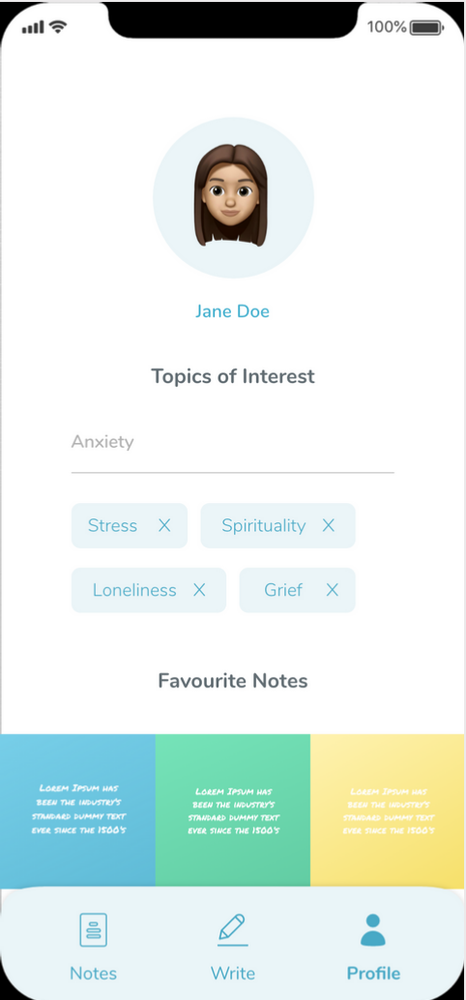
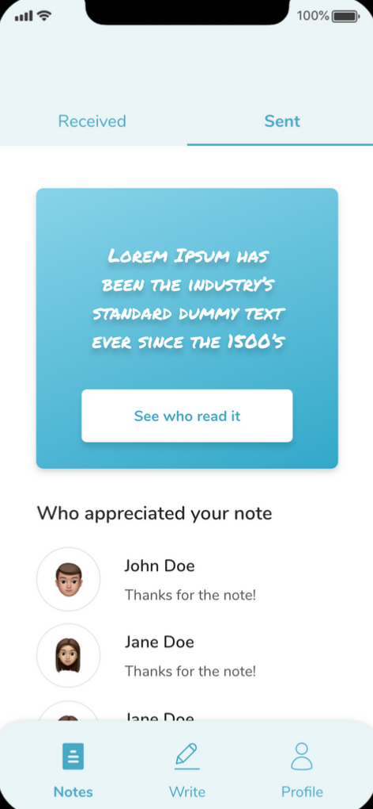

# Kindred Notes


Kindred Notes is an iOS/Android native app for sharing and receiving kind messages with other users

[](https://github.com/sindresorhus/awesome#readme)

## Installation

In `client`:

```bash
npm i
cd ios && pod i && ../
npm run ios/android
```

In `server`:

```
npm i && npm start
```

## Visuals

### Note creation

<br />

### Profile page

<br />

### Sent note

<br />

### Receive note

<br />

## Contributing

Pull requests are welcome. For major changes, please open an issue first to discuss what you would like to change.

## License

[MIT](https://choosealicense.com/licenses/mit/)
